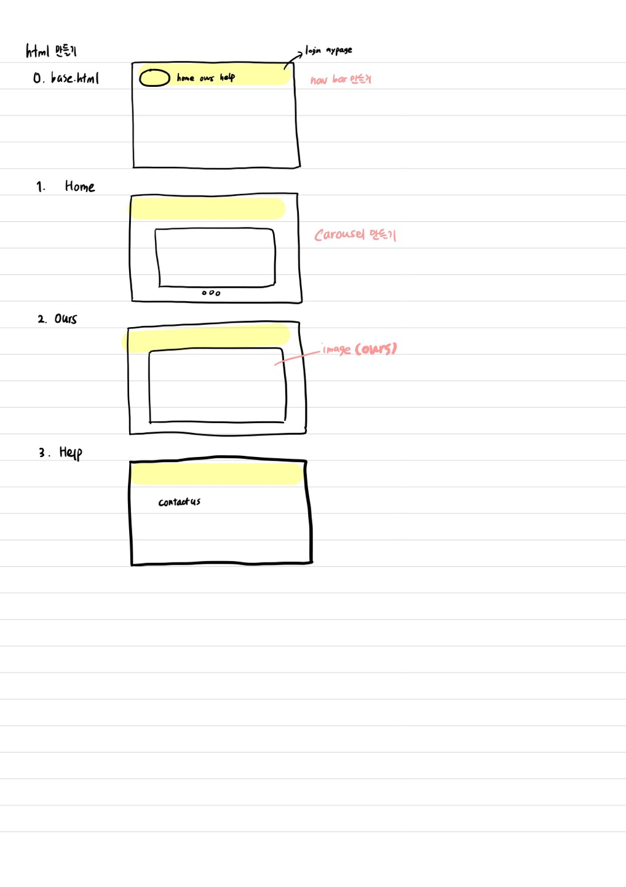
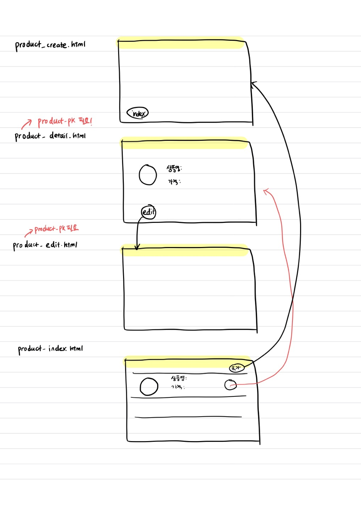

# LEFTWRAP


❤️ 지은이와 지하의 LEFTWRAP 서비스 개발 기록지! 🧡


🌍 해야되는 일

1. django로 사이트 뼈대 만들기
2. HTML 이쁘게 꾸미기
3. 데이터 만들기
4. 상용화! (배포 ?? )


🌍 일정

** 우리는 격일로 수업 시간 후 8-11시까지 프로젝트 진행!

1. django로 사이트 뼈대 만들기 - 5/22일까지
2. HTML 이쁘게 꾸미기               - 5/24일까지
3. 데이터 만들기                          - 5/25일까지
4. 상용화! (배포 ?? )                     - 5/26일까지


🌍 DJANGO 작성 일정

1. modeling(다같이) : ~ 5월 17일 저녁까지 끝내는 것이 목표
   1. DB 계획
   2. MODELS.py 작성
   3. serializers.py 작성

2. urls, views(지하) : ~ 5월 22일까지 각자 끝내는 것이 목표
   1. urls.py 작성
   2. views.py 작성
3. forms, templates(지은) : ~ 5월 22일까지 각자 끝내는 것이 목표
   1. forms.py 작성
   2. templates html 작성!


🌍 모델짜기

1. customer 테이블

   : 사용자의 정보를 담고 있는 테이블

| 필드명   | 데이터 유형  | 역할                | 비고 |
| -------- | ------------ | ------------------- | ---- |
| Location | Varchar(100) | 주소                |      |
| KEY      | Integer      | 0 = 고객 / 1 = 점주 |      |

2. vendor 테이블

   : 상점의 정보를 담고 있는 테이블

| 필드명       | 데이터유형    | 역할      | 비고 |
| ------------ | ------------- | --------- | ---- |
| CUSTOMER     |               | 외래키    |      |
| Phone Number | Varchar(20)   | 연락처    |      |
| ShopName     | Varchar(100)  | 상호명    |      |
| CloseTime    | DateTimeField | 폐점 시간 |      |
| Description  | TextField     | 소개      |      |

3. product 테이블

   : 당일폐기되는 음식들의 정보를 담고 있는 테이블

| 필드명   | 데이터유형   | 역할           | 비고                            |
| -------- | ------------ | -------------- | ------------------------------- |
| Name     | Varchar(100) | 상품명         |                                 |
| Price    | Integer      | 원가           |                                 |
| Category | Varchar      | 카테고리       |                                 |
| Count    | Integer      | 남은 재고 수량 | 문닫는 시간 지나면 0으로 초기화 |
| Like     | ManyToMany   | 좋아요         | PJT09                           |

4. sales 테이블

   : 할인 판매되는 제품들의 정보를 담는 테이블

|   필드명    |  데이터유형  |      역할      |              비고               |
| :---------: | :----------: | :------------: | :-----------------------------: |
|    Name     | Varchar(100) |     상품명     |   기본적으로 1번 인덱스의 값    |
|    Count    |   Integer    | 남은 재고 수량 | 문닫는 시간 지나면 0으로 초기화 |
| Description |  TextField   |      소개      |                                 |
|    Price    |   Integer    |      가격      |                                 |
|  Category   |   Varchar    |    카테고리    |                                 |

5. sales_detail 테이블

   : 재고를 알려주는 테이블, 할인품목 카테고리 별로 

| 필드명  | 데이터유형 |      역할       | 비고 |
| :-----: | :--------: | :-------------: | :--: |
| Product |  Integer   | 외래키(제품 PK) |      |
|  Count  |  Integer   |    물품 수량    |      |

6. comment 테이블

   : 각 상점에 대한 후기를 볼 수 있음

|   필드명   |   데이터유형   |  역할  | 비고 |
| :--------: | :------------: | :----: | :--: |
|   VENDOR   |                | 외래키 |      |
|  CUSTOMER  |                | 외래키 |      |
|  CONTENT   | CharField(100) |  댓글  |      |
| CREATED_AT | DateTimeField  |        |      |
| UPDATED_AT | DateTimeField  |        |      |


🌍 조금 더 욕심

```
1. 주소 API로 가져와서 도로명주소 가능하게끔!
2. AUTHORIZATION 허가를 받은 VENDOR만 들어올 수 있게끔!
```


____

# 프로젝트 일지


## DAY1

* 한 일
  * 모델 구상하기
  * SERIALIZER 구상하기
* 어려웠던 점
  * 모델이 하도 많아서 어떻게 구상해야할지 감이 안잡힘 ㅜ 
  * accounts가 customer도 있고 vendor도 있는데 한개로 합친 user로 사용할지 따로따로 테이블을 만들지 고민 ㅠㅠ 
  * serializers 배운지 하도 오래되서 시작을 못함 ㅠㅠ

___

## DAY2

* 한 일

  * 어제 구상한 모델 직접 코드 작성하고 손 보기
  * HTML 어떻게 만들지 한번 그려보기
  * URLS 주소 이름 부여하기
  * accounts에 구분키를 넣어서 0인 경우 customer, 1인 경우 vendor로 작성함

* 배운점

  * 계속 not null contraints failed가 뜨길래 뭐지,, 했는데 default = False를 넣어줘야 문제가 생기지 않음!

    => 아무것도 없는 상태로 들어가면 빈 값이 되므로 테이블이 작성되기 어려움

```python
# accounts/models.py

class User(AbstractUser):
    # 구분자 넣기
    division = models.BooleanField(default = False)
```






___

## DAY3

